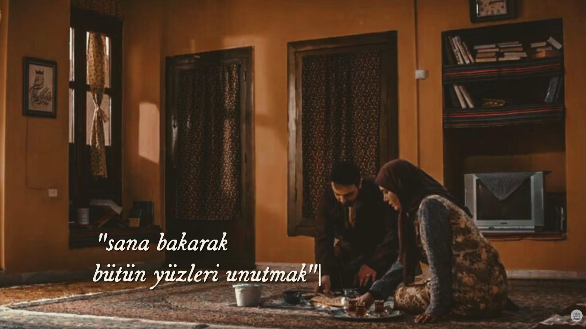

vakit geldi kunâla  
dünyayı göreli çok oldu  
tam kırk yılda seni buldum kunâla  
bu can tenden geçmeden  
bu dünyadan göçmeden  
bir kerecik sevmek çok değil

simsiyah saçların var kunâla  
kemiklerine yapışık etlerin var  
bir gün dökülecek  
kunâla kuşu gibi gözlerin var  
bir gün sönecek  
kunâla  
bu etlerin arkasında güzelliklerin var  
benden başka kimse bilmeyecek

bu can içimde kuştur kunâla  
seni görünce titrer  
bu can gözümde muhabbettir kunâla  
seni görünce yanar  
bu can burnumda soluk olur kunâla  
uçar gider

bu can benden geçmeden  
bu dünyadan göçmeden  
bir tek seni sevmek çok değil

Kunâla | Asaf Halet Çelebi  
[Furkan Özdemir](https://www.youtube.com/watch?v=1UxlK4T4sPA "Furkan Özdemir YouTube")